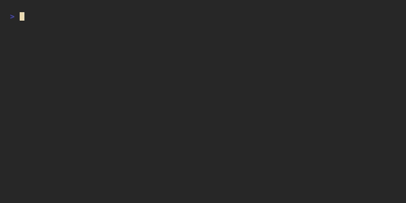

# sync

**What it does:** Uploads Claude memory files and journal Markdown notes to Nextcloud via WebDAV. Credentials are stored in the system keyring (never in plaintext).



**Sources synced:**
- `~/.claude/CLAUDE.md`
- `~/.claude/projects/<user>/memory/*.md`
- `~/documents/journal/YYYY-MM-DD.md`

**Destinations on Nextcloud:**
- `backups/claude-memory/`
- `backups/journal/`

**First-time setup:**
```bash
x sync --configure
# prompts for: Nextcloud URL, username, app password
# app password: Nextcloud → Settings → Security → App passwords
```

**Usage:**
```bash
x sync              # sync everything
x sync --claude     # Claude memory files only
x sync --journal    # journal notes only
x sync --restore    # restore everything from Nextcloud to local
x sync --restore --claude   # restore Claude memory only
x sync --restore --journal  # restore journal only
```

**Restoring on a new machine:**
```bash
x sync --configure  # enter Nextcloud credentials
x sync --restore    # downloads files to the correct local paths
```

Files are routed automatically: `CLAUDE.md` → `~/.claude/`, memory files → `~/.claude/projects/<user>/memory/`, journal → `~/documents/journal/`. Existing files are overwritten.

**Dependencies:**
- `requests` — WebDAV HTTP calls
- `keyring` + `keyrings.alt` — secure credential storage (WSL fallback via `keyrings.alt`)

**Manual test:**
```bash
x sync --configure   # enter real or dummy creds
x sync --journal     # upload journal notes, verify in Nextcloud web UI
```
